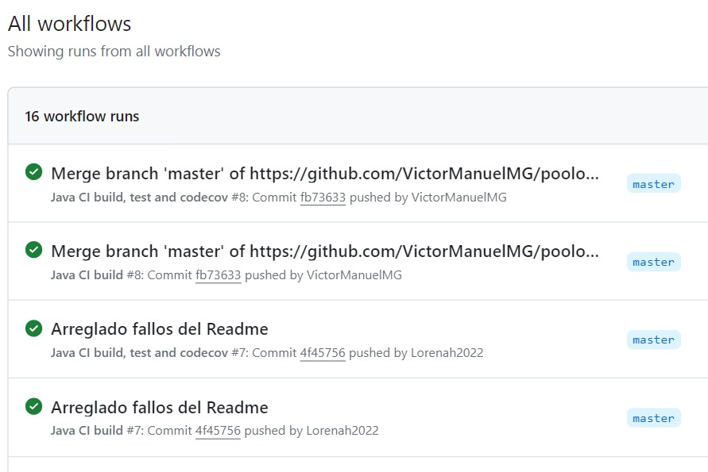

poolobject
==========

Java code example of creational design pattern pool object

 

Workshop to use good practices in software development: testing, ci and measurement.

Informe
==========
Authors:

- Víctor Manuel Martínez García
- Lorena Bueno Porras

## Índice
[1. ¿Se ha realizado trabajo en equipo?](#1-se-ha-realizado-trabajo-en-equipo)

[2. ¿Tiene calidad el conjunto de pruebas disponibles?](#¿Tiene-calidad-el-conjunto-de-pruebas-disponibles?)

[3. ¿Cuál es el esfuerzo invertido en realizar la actividad?](#¿Cuál-es-el-esfuerzo-invertido-en-realizar-la-actividad?)

[4. ¿Cuál es el número de fallos encontrados en el código original?](#¿Cuál-es-el-número-de-fallos-encontrados-en-el-código-original?)

[5. ¿El proceso de integración continúa realizado ha sido de calidad?](#¿El-proceso-de-integración-continúa-realizado-ha-sido-de-calidad?)

## Preguntas:
### 1. ¿Se ha realizado trabajo en equipo?
Sí, el trabajo se ha realizado en equipo. Ambos integrantes del grupo han compartido ideas y participado en la realización del proyecto.

### 2. ¿Tiene calidad el conjunto de pruebas disponibles?
Sí, ya que se ha intentado garantizar que el código funcione incluso en los casos más extremos. El porcentaje de cobertura del código se puede comprobar a través de la herramienta Codecov. En nuestro caso contamos con una cobertura del 73%.

   
### 3. ¿Cuál es el esfuerzo invertido en realizar la actividad?
El esfuerzo invertido no ha sido excesivamente elevado, ya que la entrega se ha podido realizar en las clases prácticas, teniendo que dedicarla solamente un par de horas en casa.
   
### 4. ¿Cuál es el número de fallos encontrados en el código original?
No se han encontrado errores en el código original ya que en el Actions no se encuentra ningún error. Lo único que se pueden encontrar errores al realizar un push en la compilación del ant, ya que esta programado para que de fallos, esto es debido a que el programa esta obligado a fallar, mediante el comando fail(). 
   
### 5. ¿El proceso de integración continúa realizado ha sido de calidad?
Sí, ya que se han podido fusionar los cambios de código de los integrantes del grupo en un único proyecto, sobre el cual luego se han ejecutado las pruebas.

