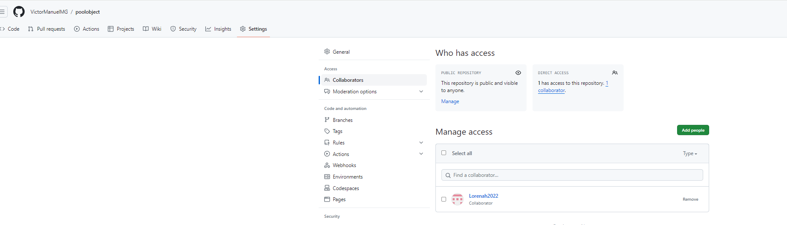

poolobject
==========

Java code example of creational design pattern pool object

 

Workshop to use good practices in software development: testing, ci and measurement.

Informe
==========
Authors:

- Víctor Manuel Martínez García
- Lorena Bueno Porras

## Índice
[Objetivos](#objetivos)

[Enunciado](#enunciado)

[Preguntas](#preguntas)

- [1. ¿Se ha realizado trabajo en equipo?](#1-se-ha-realizado-trabajo-en-equipo)

- [2. ¿Tiene calidad el conjunto de pruebas disponibles?](#2-tiene-calidad-el-conjunto-de-pruebas-disponibles)

- [3. ¿Cuál es el esfuerzo invertido en realizar la actividad?](#3-cuál-es-el-esfuerzo-invertido-en-realizar-la-actividad)

- [4. ¿Cuál es el número de fallos encontrados en el código original?](#4-cuál-es-el-número-de-fallos-encontrados-en-el-código-original)

- [5. ¿El proceso de integración continúa realizado ha sido de calidad?](#5-el-proceso-de-integración-continúa-realizado-ha-sido-de-calidad)

## Objetivos
En esta práctica se pretende alcanzar los siguientes objetivos:
- Comprender los objetivos de medición relacionados con la caracterización y la evaluación de
productos, procesos y recursos software.
- Comprender, aplicar y analizar técnicas de medición sobre entidades de productos software
relacionados con conjuntos de pruebas de software.
- Comprender, aplicar y analizar medidas relacionadas sobre entidades de proceso y recursos de
prueba del software.

## Enunciado
En la práctica se va simular un pequeño desarrollo de un producto software para realizar mediciones sobre él.
El objetivo es establecer un caso de estudio dummy que sirva para caracterizar y evaluar tanto el producto
desarrollado como el proceso seguido.

### Descripción del producto
Dado un código de ejemplo del patrón diseño creacional Pool Object, se debe crear una batería de pruebas tal que las coberturas de sus clases sean del 100%. El código de las clases se puede obtener en el repositorio https://github.com/clopezno/poolobject. La batería de pruebas JUnit debe estar contenida en la clase ubu.gii.dass.test.c01.ReuseblePoolTest.java.

### Descripción del proceso
Pasos a realizar:
- Se añaden a ambos colaboradores en el repositorio empleado para la realización de la práctica.

- Se realiza la vinculación del proyecto con Github actions y Codecov.io. En nuestro caso no se emplea Travis CI, utilizandose únicamente Ants. Posteriormente se realiza la actualizacion de los badgets.

- Se ha realizado el proceso de desarrollo en equipo, como se puede apreciar en los commits

- En nuestro caso, no se ha podido alcanzar el coverage del 100%, llegando solo a abarcar una cobertura del 73% teniendo en cuenta todas las características del programa.

## Preguntas:
### 1. ¿Se ha realizado trabajo en equipo?
Sí, el trabajo se ha realizado en equipo. Ambos integrantes del grupo han compartido ideas y participado en la realización del proyecto.

### 2. ¿Tiene calidad el conjunto de pruebas disponibles?
Sí, ya que se ha intentado garantizar que el código funcione incluso en los casos más extremos. El porcentaje de cobertura del código se puede comprobar a través de la herramienta Codecov. En nuestro caso contamos con una cobertura del 73%.

   
### 3. ¿Cuál es el esfuerzo invertido en realizar la actividad?
El esfuerzo invertido no ha sido excesivamente elevado, ya que la entrega se ha podido realizar en las clases prácticas, teniendo que dedicarla solamente un par de horas en casa.
   
### 4. ¿Cuál es el número de fallos encontrados en el código original?
No se han encontrado errores en el código original ya que en el Actions no se encuentra ningún error. Lo único que se pueden encontrar errores al realizar un push en la compilación del ant, ya que esta programado para que de fallos, esto es debido a que el programa esta obligado a fallar, mediante el comando fail(). 
   
### 5. ¿El proceso de integración continúa realizado ha sido de calidad?
Sí, ya que se han podido fusionar los cambios de código de los integrantes del grupo en un único proyecto, sobre el cual luego se han ejecutado las pruebas.

